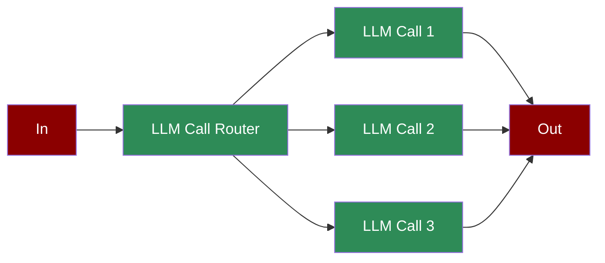

# Agentic Routing



A low-latency workflow where inputs are dynamically routed to the most appropriate LLM instance or configuration, optimizing efficiency and specialization.

## Quick Start

## Understanding Agentic Routing

## Features

## Configuration Options

```python
# Create a router agent

router = Agent(
 name="Router",
 role="Input Router",
 goal="Evaluate input and determine routing path",
 instructions="Analyze input and decide whether to proceed or exit",
 tools=[get_time_check], # Custom tools for routing decisions

 verbose=True # Enable detailed logging

)

# Task with routing configuration

routing_task = Task(
 name="initial_routing",
 description="Route based on conditions",
 expected_output="Routing decision",
 agent=router,
 is_start=True,
 task_type="decision",

)
```

## RouterAgent - Advanced Dynamic Routing

The RouterAgent is a specialized agent that provides intelligent model selection based on task requirements, optimizing for both performance and cost.

### RouterAgent Features

### Using RouterAgent

```python
from praisonaiagents.agent.router_agent import RouterAgent
from praisonaiagents.llm.model_router import ModelRouter
from praisonaiagents import Task, PraisonAIAgents

# Option 1: Simple RouterAgent with model list

router_agent = RouterAgent(
 name="Smart Router",
 role="Task Router", # Use 'role' not 'description'

 goal="Route tasks to optimal models",
 backstory="I analyze tasks and select the most appropriate model",
 models=["gpt-4o-mini", "gpt-4o", "claude-3-5-sonnet-20241022"],
 routing_strategy="cost-optimized", # "auto", "manual", "cost-optimized", "performance-optimized"

 verbose=True
)

# Execute tasks (not chat)

result = router_agent.execute("What is 2+2?")
print(f"Result: {result}")

# For complex tasks

result = router_agent.execute("Write a comprehensive business plan for a SaaS startup")
print(f"Result: {result}")

# Get usage report to see which models were used

usage_report = router_agent.get_usage_report()
print(f"Usage report: {usage_report}")
```

### RouterAgent with Custom ModelRouter

For more control over cost thresholds and provider preferences, use a custom ModelRouter:

```python
from praisonaiagents.agent.router_agent import RouterAgent
from praisonaiagents.llm.model_router import ModelRouter

# Create custom ModelRouter with cost control

custom_router = ModelRouter(
 cost_threshold=0.10, # Max cost per request

 preferred_providers=["openai", "anthropic"]
)

# Create RouterAgent with custom router

router_agent = RouterAgent(
 name="Smart Router",
 role="Task Router",
 goal="Route tasks to optimal models with cost control",
 model_router=custom_router,
 routing_strategy="auto",
 verbose=True
)
```

### Using RouterAgent with Tasks and Workflows

The RouterAgent is designed to work within the PraisonAI framework:

```python
from praisonaiagents.agent.router_agent import RouterAgent
from praisonaiagents import Task, PraisonAIAgents

# Create router agent

router_agent = RouterAgent(
 name="Adaptive Assistant",
 role="Multi-Model Assistant",
 goal="Complete tasks using the most appropriate model",
 backstory="I intelligently route tasks to different models based on complexity",
 models=["gpt-4o-mini", "gpt-4o", "claude-3-5-sonnet-20241022"],
 routing_strategy="auto",
 verbose=True
)

# Create tasks for the router agent

simple_task = Task(
 description="What is the capital of France?",
 expected_output="A simple answer",
 agent=router_agent
)

complex_task = Task(
 description="Analyze the economic impact of renewable energy adoption in developing countries",
 expected_output="A comprehensive analysis",
 agent=router_agent
)

# Run with PraisonAIAgents

agents = PraisonAIAgents(
 agents=[router_agent],
 tasks=[simple_task, complex_task],
 process="sequential"
)

results = agents.start()

# View results

for task_id, result in results['task_results'].items():
 print(f"Task: {result.description[:50]}...")
 print(f"Result: {result.raw[:100]}...")
 print("-" * 50)
```

### RouterAgent Initialization Parameters

The RouterAgent accepts these parameters:

| Parameter | Type | Description | Default |
|-----------|------|-------------|---------|
| `models` | List[str] or Dict | List of model names or model configuration | None |
| `model_router` | ModelRouter | Custom ModelRouter instance | None |
| `routing_strategy` | str | Strategy: "auto", "manual", "cost-optimized", "performance-optimized" | "auto" |
| `primary_model` | str | Primary model to use | None |
| `fallback_model` | str | Fallback model for errors | None |
| `**kwargs` | Any | Standard Agent parameters (name, role, goal, etc.) | - |

### Real-World Example: Multi-Provider Cost Optimization

```python
from praisonaiagents.agent.router_agent import RouterAgent
from praisonaiagents import Task, PraisonAIAgents

# Example from examples/agents/router-agent-cost-optimization.py

router = RouterAgent(
 name="Cost-Optimized Assistant",
 role="Efficient Task Processor",
 goal="Complete tasks with optimal cost-performance balance",
 models=[
 "gpt-4o-mini", # Cheap, fast for simple tasks

 "gpt-4o", # Balanced for medium complexity

 "gpt-4", # Powerful for complex tasks

 "claude-3-5-sonnet-20241022" # Alternative provider

 ],
 routing_strategy="cost-optimized",
 primary_model="gpt-4o-mini",
 fallback_model="gpt-4o"
)

# The router will automatically:

# - Use gpt-4o-mini for simple queries

# - Upgrade to gpt-4o or gpt-4 for complex tasks

# - Fall back to gpt-4o if the primary model fails

```

### Important Notes

```

## Troubleshooting

## Next Steps