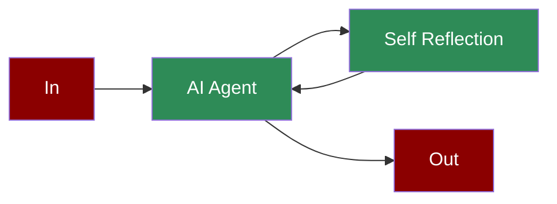

# Self Reflection AI Agents



Self-reflection enables agents to evaluate and improve their own responses before delivering them.

## Quick Start

## Understanding Self-Reflection

## Features

## Multi-Agent Self-Reflection

### Configuration Options

```python
# Create an agent with advanced self-reflection configuration

agent = Agent(
 role="Research Analyst",
 goal="Provide comprehensive analysis",
 backstory="Expert analyst with critical thinking skills",
 self_reflect=True, # Enable self-reflection

 verbose=True, # Enable detailed logging

 llm="gpt-4o", # Language model to use

 allow_delegation=True # Allow task delegation

)
```

## Troubleshooting

## Next Steps