# Sessions & Remote Agents

The session system provides stateful conversation management and remote agent connectivity, enabling persistent interactions and distributed agent deployments.

```mermaid
graph TB
 subgraph Local Sessions
 LS[🔐 Session Manager]
 MEM[🧠 Memory]
 KNOW[📚 Knowledge]
 STATE[💾 State]
 end

 subgraph Remote Sessions
 CLIENT[💻 Client]
 REMOTE[☁️ Remote Agent]
 API[🌐 API Endpoint]
 end

 User([👤 User]) --> LS
 LS --> MEM
 LS --> KNOW
 LS --> STATE

 User --> CLIENT
 CLIENT --> API
 API --> REMOTE

 classDef user fill:#8B0000,stroke:#7C90A0,color:#fff
 classDef local fill:#189AB4,stroke:#7C90A0,color:#fff
 classDef remote fill:#2E8B57,stroke:#7C90A0,color:#fff

 class User user
 class LS,MEM,KNOW,STATE local
 class CLIENT,REMOTE,API remote
```



## Overview

Sessions provide two powerful capabilities:
1. **Stateful Local Sessions**: Maintain conversation state, memory, and knowledge across interactions
2. **Remote Agent Connectivity**: Connect to agents running on other machines or cloud services

## Local Sessions

### Basic Usage

### Memory Integration

Sessions can maintain memory across conversations:

```python
# Session with memory configuration

session = Session(
 session_id="chat_123",
 user_id="user_456",

)

# Add memories directly

session.add_memory("User prefers technical explanations")

# Search memories

memories = session.search_memory("preferences")

# Agent automatically uses session memory

agent = session.Agent(name="Assistant", memory=True)
```

### Knowledge Integration

Attach knowledge bases to sessions:

```python
# Session with knowledge

session = Session(
 session_id="research_session",
 user_id="researcher_1",

 }
 }
)

# Add knowledge to session

session.add_knowledge("research_paper.pdf")
session.add_knowledge("Important finding: AI improves efficiency by 40%")

# Search knowledge

results = session.search_knowledge("efficiency improvements")

# Agents use session knowledge

agent = session.Agent(
 name="Research Assistant",
 knowledge=True
)
```

## Remote Agents

### Connecting to Remote Agents

### Remote Agent Server

Create an agent server for remote access:

```python
# remote_agent_server.py

from flask import Flask, request, jsonify
from praisonaiagents import Agent

app = Flask(__name__)

# Create your agent

agent = Agent(
 name="Remote Assistant",
 instructions="You are a helpful remote assistant.",
 tools=[...], # Your tools

 memory=True
)

@app.route('/agent', methods=['POST'])
def handle_message():
 data = request.json
 message = data.get('message', '')
 session_id = data.get('session_id')

 # Process message

 response = agent.chat(message, session_id=session_id)

 return jsonify({
 'content': response,
 'session_id': session_id,
 'metadata': {
 'agent_name': agent.name,
 'timestamp': datetime.now().isoformat()
 }
 })

if __name__ == '__main__':
 app.run(host='0.0.0.0', port=8000)
```

## Session Configuration

### Local Session Options

```python
session = Session(
 # Required

 session_id="unique_session_id",

 # Optional

 user_id="user_identifier",

 # Memory configuration

 ,

 # Knowledge configuration

 }
 }
)
```

### Remote Session Options

```python
session = Session(
 # Remote agent URL

 agent_url="https://api.example.com/agent",

 # Optional timeout (default: 30 seconds)

 timeout=60,

 # Optional headers for authentication

)
```

## State Management

### Saving Session State

```python
# Save current state

session.save_state()

# State includes:

# - Session metadata

# - Memory contents

# - Knowledge references

# - Agent configurations

```

### Restoring Session State

```python
# Create new session instance

session = Session(session_id="chat_123")

# Restore previous state

session.restore_state()

# Continue where you left off

agent = session.Agent(name="Assistant")
response = agent.chat("What were we discussing?")
```

### State Persistence Location

By default, session state is saved to:
* `.sessions/{session_id}/state.json` - Session metadata
* `.sessions/{session_id}/memory/` - Memory databases
* `.sessions/{session_id}/knowledge/` - Knowledge databases

## Advanced Features

### Session Context

Access session context programmatically:

```python
# Get session context

context = session.get_context()
print(f"Session ID: {context['session_id']}")
print(f"User ID: {context['user_id']}")
print(f"Created: {context['created_at']}")
print(f"Messages: {context['message_count']}")
```

### Multi-Agent Sessions

Use multiple agents within a session:

```python
session = Session(session_id="team_session")

# Create multiple agents in session

researcher = session.Agent(
 name="Researcher",
 instructions="You research topics"
)

writer = session.Agent(
 name="Writer",
 instructions="You write content"
)

# Agents share session memory and knowledge

research = researcher.chat("Research AI trends")
article = writer.chat("Write an article about the research")
```

### Session Middleware

Add custom middleware to sessions:

```python
def logging_middleware(message, response):
 print(f"[{datetime.now()}] Message: {message}")
 print(f"[{datetime.now()}] Response: {response[:100]}...")
 return response

session = Session(
 session_id="logged_session",
 middleware=[logging_middleware]
)
```

## Use Cases

## Complete Example

## Best Practices

## Next Steps