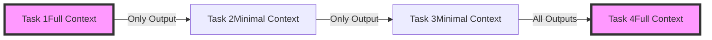

# Task Context Control

## Overview

Task Context Control allows you to manage how information flows between tasks in your workflows. In long workflows with many steps, passing the entire context forward can lead to token limit issues and irrelevant information cluttering the context. This feature gives you fine-grained control over what information each task receives.



## Quick Start

Control context flow between tasks using the `retain_full_context` parameter:

```python
from praisonaiagents import Agent, Task, PraisonAIAgents

# Create an agent

processor = Agent(
 name="DataProcessor",
 role="Data analysis expert",
 goal="Process and analyze data efficiently"
)

# Task with minimal context (only passes its output)

task1 = Task(
 name="extract_data",
 description="Extract data from source files",
 expected_output="Extracted data in JSON format",
 agent=processor,
 retain_full_context=False # Only pass this task's output forward

)

# Task that needs full historical context

task2 = Task(
 name="analyze_trends",
 description="Analyze trends across all previous data",
 expected_output="Comprehensive trend analysis",
 agent=processor,
 retain_full_context=True # Include all previous outputs

)

# Create and run workflow

agents = PraisonAIAgents(
 agents=[processor],
 tasks=[task1, task2],
 process="sequential"
)

result = agents.start()
```

## Key Features

### 1. Selective Context Retention

Choose what information to pass between tasks:

```python
from praisonaiagents import Agent, Task, PraisonAIAgents

# Define agents for the pipeline

data_loader = Agent(
 name="DataLoader",
 role="Data loading specialist",
 goal="Load and prepare data efficiently"
)

data_cleaner = Agent(
 name="DataCleaner",
 role="Data preprocessing expert",
 goal="Clean and preprocess data"
)

analyst = Agent(
 name="Analyst",
 role="Statistical analyst",
 goal="Perform comprehensive data analysis"
)

# Data processing pipeline with selective context

raw_data_task = Task(
 name="load_raw_data",
 description="Load 10GB of raw data",
 expected_output="Data loading summary",
 agent=data_loader,
 retain_full_context=False # Don't pass raw data forward

)

clean_data_task = Task(
 name="clean_data",
 description="Clean and preprocess data",
 expected_output="Cleaned data statistics",
 agent=data_cleaner,
 retain_full_context=False # Only pass statistics forward

)

analyze_task = Task(
 name="analyze_data",
 description="Perform statistical analysis",
 expected_output="Analysis results",
 agent=analyst,
 retain_full_context=True # Need all previous summaries

)
```

### 2. Context Windows

Manage context windows for optimal performance:

```python
# Define the summarizer agent

summarizer = Agent(
 name="Summarizer",
 role="Content summarizer",
 goal="Create concise and accurate summaries"
)

# Configure context window sizes

summary_task = Task(
 name="summarize_chapter",
 description="Summarize this book chapter",
 expected_output="Chapter summary",
 agent=summarizer,
 retain_full_context=False,
 max_context_length=2000 # Limit input context size

)

# Task that needs more context

final_summary = Task(
 name="create_book_summary",
 description="Create overall book summary from chapter summaries",
 expected_output="Complete book summary",
 agent=summarizer,
 retain_full_context=True,
 max_context_length=8000 # Larger context for all summaries

)
```

### 3. Context Filtering

Filter specific types of information:

```python
from praisonaiagents import Task, ContextFilter

# Custom context filter

class DataContextFilter(ContextFilter):
 def filter(self, context):
 """Keep only specific data types"""
 filtered = {}
 for key, value in context.items():
 if key in ['summary', 'metrics', 'errors']:
 filtered[key] = value
 return filtered

# Apply filter to task

analysis_task = Task(
 name="final_analysis",
 description="Analyze filtered results",
 expected_output="Analysis report",
 agent=analyst,
 context_filter=DataContextFilter()
)
```

## Advanced Usage

### Dynamic Context Control

Adjust context retention based on workflow state:

```python
class DynamicContextWorkflow:
 def __init__(self):
 self.context_size = 0
 self.max_context = 4000

 def create_task(self, name, description, agent):
 # Dynamically decide context retention

 retain_full = self.context_size retain_full_context=False
2. Clean Data -> retain_full_context=False
3. Extract Features -> retain_full_context=False
4. Summarize Features -> retain_full_context=True
5. Train Model -> retain_full_context=False
6. Evaluate Model -> retain_full_context=True
"""
```

### 2. Monitor Context Size

Track context growth throughout workflow:

```python
from praisonaiagents.callbacks import Callback

class ContextMonitor(Callback):
 def on_task_start(self, task, context, **kwargs):
 context_size = len(str(context))
 print(f"Task {task.name} context size: {context_size} chars")

 if context_size > 10000:
 print(f"WARNING: Large context for {task.name}")

# Use monitor

agents = PraisonAIAgents(
 agents=[processor],
 tasks=tasks,
 callbacks=[ContextMonitor()]
)
```

### 3. Use Context Summaries

Create summary tasks to condense information:

```python
def create_summary_checkpoint(previous_tasks, agent):
 """Create a summary checkpoint after a batch of tasks"""
 return Task(
 name=f"summary_checkpoint_{len(previous_tasks)}",
 description=f"Summarize outputs from the last {len(previous_tasks)} tasks",
 expected_output="Concise summary of key findings",
 agent=agent,
 retain_full_context=True, # Get all context

 next_retain_full_context=False # But don't pass it all forward

 )
```

## Performance Optimization

### Token Usage Optimization

Minimize token usage with smart context control:

```python
# Calculate optimal context retention

def should_retain_full_context(task_index, total_tasks):
 """Determine if task should retain full context"""
 # Key decision points need full context

 decision_points = [0, total_tasks // 2, total_tasks - 1]

 # Summary tasks need full context

 is_summary = (task_index % 10 == 9)

 return task_index in decision_points or is_summary
```

### Memory Management

Efficient memory usage in long workflows:

```python
from praisonaiagents import Task

# Clear unnecessary data

class MemoryEfficientTask(Task):
 def __init__(self, *args, **kwargs):
 super().__init__(*args, **kwargs)
 self.clear_on_complete = kwargs.get('clear_on_complete', True)

 def on_complete(self, result):
 if self.clear_on_complete and not self.retain_full_context:
 # Clear large data after task completes

 self.context = {"summary": result.summary}
```

## Troubleshooting

### Common Issues

1. **Context Loss**: Important information not reaching later tasks
- Solution: Use checkpoints or summary tasks
2. **Token Limits**: Exceeding model token limits
- Solution: Implement aggressive context filtering
3. **Performance Degradation**: Slow processing with large contexts
- Solution: Use `retain_full_context=False` for most tasks

### Debugging Context Flow

```python
# Debug context flow

agents = PraisonAIAgents(
 agents=[processor],
 tasks=tasks,
 verbose=True, # Show context at each step

 debug_context=True # Additional context debugging

)
```

## See Also

- [Context Window Management](/features/context-window-management) - Automatic token management
- [Advanced Memory](/features/advanced-memory) - Long-term memory systems
- [Workflow Validation](/features/workflow-validation) - Validation loops with context