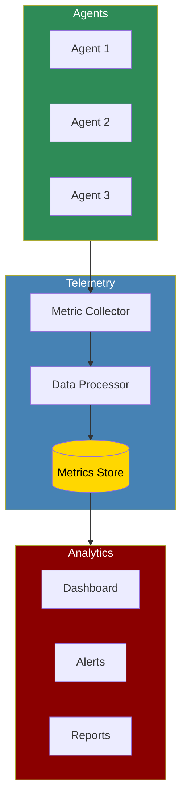

# Telemetry & Performance Tracking



The Telemetry system provides minimal, privacy-focused usage tracking for PraisonAI Agents. It collects only anonymous metrics about feature usage, with no personal data, prompts, or responses tracked. Telemetry is enabled by default but can be easily disabled via environment variables.

## Quick Start

## What is Tracked

PraisonAI telemetry collects only minimal, anonymous metrics:

## Disabling Telemetry

Telemetry can be disabled in multiple ways:

### Environment Variables (Recommended)

```bash
# Set any of these before running your code

export PRAISONAI_TELEMETRY_DISABLED=true
export PRAISONAI_DISABLE_TELEMETRY=true
export DO_NOT_TRACK=true # Universal standard

```

### Programmatically

```python
# Option 1: Disable before importing

from praisonaiagents.telemetry import disable_telemetry
disable_telemetry()

# Then import and use normally

from praisonaiagents import Agent, Task, PraisonAIAgents

# Option 2: Disable at runtime

from praisonaiagents.telemetry import get_telemetry
telemetry = get_telemetry()
telemetry.enabled = False
```

## How Telemetry Works

Telemetry in PraisonAI is automatic and minimal:
1. **Automatic Integration**: When you create agents and run workflows, telemetry is automatically integrated
2. **Anonymous Tracking**: Only counts and types are tracked, never content
3. **Memory Storage**: Currently metrics are only stored in memory (no network calls)
4. **Session-based**: Each run gets a unique anonymous session ID
5. **Privacy-first**: Respects DO_NOT_TRACK standard and multiple opt-out methods

## Advanced Usage

### Accessing Telemetry Data

```python
from praisonaiagents.telemetry import get_telemetry

# Get the global telemetry instance

telemetry = get_telemetry()

# Check if telemetry is enabled

if telemetry.enabled:
 print("Telemetry is active")

# Get current metrics

metrics = telemetry.get_metrics()
print(f"Total agent executions: {metrics['agent_executions']}")
print(f"Total task completions: {metrics['task_completions']}")
print(f"Total tool calls: {metrics['tool_calls']}")
print(f"Total errors: {metrics['errors']}")

# Get session info

print(f"Session ID: {telemetry.session_id}")
print(f"Environment: {telemetry._environment}")
```

### Manual Tracking (Advanced)

```python
from praisonaiagents.telemetry import get_telemetry

# Get telemetry instance

telemetry = get_telemetry()

# Manually track events (usually automatic)

telemetry.track_agent_execution(agent_name="MyAgent", success=True)
telemetry.track_task_completion(task_name="MyTask", success=True)
telemetry.track_tool_usage(tool_name="web_search", success=True)
telemetry.track_error(error_type="ValueError")

# Track feature usage

telemetry.track_feature_usage("custom_feature")
```

## Integration with External Services

### PostHog Integration (Coming Soon)

PraisonAI telemetry includes built-in PostHog support for anonymous analytics:

```python
# PostHog integration is automatic when available

# Metrics are sent anonymously with session IDs only

# No configuration needed - it just works

# To verify PostHog is available:

try:
 import posthog
 print("PostHog integration available")
except ImportError:
 print("PostHog not installed - metrics stored locally only")
```

### AgentOps Integration

For more advanced monitoring, you can use AgentOps alongside the built-in telemetry:

```python
import agentops
from praisonaiagents import Agent, Task, PraisonAIAgents

# Initialize AgentOps

agentops.init(api_key="your-api-key")

# Use PraisonAI normally - both telemetry systems work together

agent = Agent(
 name="DataAnalyst",
 role="Analyst",
 goal="Analyze data"
)

task = Task(
 description="Analyze sales trends",
 agent=agent
)

workflow = PraisonAIAgents(agents=[agent], tasks=[task])
result = workflow.start()

# End AgentOps session

agentops.end_session("Success")
```

## Backward Compatibility

The telemetry module maintains compatibility with the previous interface:

```python
from praisonaiagents.telemetry import TelemetryCollector

# Legacy interface still works

collector = TelemetryCollector()
collector.start()

with collector.trace_agent_execution("MyAgent"):
 # Agent execution code

 pass

collector.stop()
```

## Best Practices

## Troubleshooting

## Next Steps