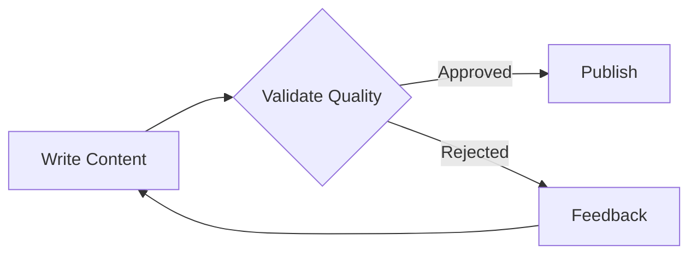

# Workflow Validation Loop

## Overview

The Workflow Validation Loop feature allows you to create workflows with built-in quality checks and automatic retry mechanisms. When a task fails validation, it can automatically retry with feedback from the validator, creating a continuous improvement loop until the output meets quality standards.



## Quick Start

Here's a simple example of implementing a validation loop where content is checked and retried if it doesn't meet quality standards:

```python
from praisonaiagents import Agent, Task, PraisonAIAgents

# Create agents

writer = Agent(
 name="Writer",
 role="Content creator",
 goal="Write high-quality blog posts"
)

validator = Agent(
 name="Validator",
 role="Quality checker",
 goal="Ensure content meets our quality standards"
)

# Define tasks

write_task = Task(
 name="write_content",
 description="Write a blog post about AI trends",
 expected_output="A well-written blog post",
 agent=writer
)

validate_task = Task(
 name="validate_content",
 description="Check if content meets quality standards",
 expected_output="Validation result: approved or rejected with feedback",
 agent=validator,
 task_type="decision",

)

publish_task = Task(
 name="publish_task",
 description="Publish the approved content",
 expected_output="Published content confirmation",
 agent=writer
)

# Create workflow

agents = PraisonAIAgents(
 agents=[writer, validator],
 tasks=[write_task, validate_task, publish_task],
 process="workflow" # Important for validation loops

)

# Run the workflow

result = agents.start()
```

## Key Features

### 1. Decision Tasks

Decision tasks evaluate outputs and route the workflow based on conditions:

```python
validate_task = Task(
 name="validate_content",
 description="Check quality and provide feedback",
 expected_output="Validation decision with feedback",
 agent=validator,
 task_type="decision",

)
```

### 2. Feedback Propagation

When a task is rejected and sent back for retry, the validator's feedback is automatically included in the retry context:

```python
# First attempt

write_task = Task(
 name="write_article",
 description="Write an article about quantum computing",
 expected_output="A comprehensive article",
 agent=writer
)

# Validator provides feedback

validate_task = Task(
 name="review_article",
 description="Review the article for technical accuracy and clarity",
 expected_output="Review with specific improvement suggestions",
 agent=validator,
 task_type="decision",

)
```

### 3. Multi-Stage Validation

Create complex validation workflows with multiple checkpoints:

```python
from praisonaiagents import Agent, Task

# Define validation agents

tech_reviewer = Agent(
 name="TechnicalReviewer",
 role="Technical accuracy validator",
 goal="Ensure technical correctness and accuracy"
)

style_reviewer = Agent(
 name="StyleReviewer",
 role="Writing style validator",
 goal="Ensure clarity and proper writing style"
)

senior_reviewer = Agent(
 name="SeniorReviewer",
 role="Senior quality reviewer",
 goal="Perform final quality assurance"
)

# Multiple validation stages

technical_review = Task(
 name="technical_review",
 description="Check technical accuracy",
 expected_output="Technical validation result",
 agent=tech_reviewer,
 task_type="decision",

)

style_review = Task(
 name="style_review",
 description="Check writing style and clarity",
 expected_output="Style validation result",
 agent=style_reviewer,
 task_type="decision",

)

final_review = Task(
 name="final_review",
 description="Final quality check",
 expected_output="Final approval decision",
 agent=senior_reviewer,
 task_type="decision",

)
```

## Advanced Usage

### Custom Validation Logic

Implement custom validation criteria:

```python
from praisonaiagents import Agent, Task, PraisonAIAgents

# Validator with specific criteria

validator = Agent(
 name="QualityValidator",
 role="Content quality assurance",
 goal="Ensure content meets all quality criteria",
 backstory="""You are a meticulous reviewer who checks for:
1. Accuracy and factual correctness
2. Clarity and readability
3. Proper structure and flow
4. Grammar and spelling
5. Engagement and value to readers

 Provide specific, actionable feedback for improvements."""
)

# Task with detailed validation instructions

validate_task = Task(
 name="validate_with_criteria",
 description="""Review the content and evaluate:
- Is the information accurate?
- Is it well-structured?
- Does it provide value?
- Are there any errors?

 If any criteria fails, provide specific feedback for improvement.""",
 expected_output="Detailed validation report with pass/fail decision",
 agent=validator,
 task_type="decision",

)
```

### Validation with External Tools

Integrate external validation tools:

```python
from praisonaiagents import Agent, Task, PraisonAIAgents
from praisonaiagents.tools import tool

@tool("grammar_checker")
def check_grammar(text: str) -> dict:
 """Check grammar and return issues found"""
 # Integration with grammar checking service

 return {"errors": [], "suggestions": []}

@tool("plagiarism_checker")
def check_plagiarism(text: str) -> dict:
 """Check for plagiarism"""
 # Integration with plagiarism detection

 return {"similarity_score": 0.05, "sources": []}

validator = Agent(
 name="AutomatedValidator",
 role="Automated quality checker",
 tools=["grammar_checker", "plagiarism_checker"],
 goal="Ensure content quality using automated tools"
)
```

### Retry Limits and Escalation

Implement retry limits to prevent infinite loops:

```python
from praisonaiagents import Agent, Task

# Define required agents

validator = Agent(
 name="Validator",
 role="Content validator",
 goal="Validate content quality"
)

senior_reviewer = Agent(
 name="SeniorReviewer",
 role="Senior escalation reviewer",
 goal="Handle escalated reviews"
)

class ValidationWorkflow:
 def __init__(self, max_retries=3):
 self.max_retries = max_retries
 self.retry_count = 0
 self.validator = validator
 self.senior_reviewer = senior_reviewer

 def create_validation_task(self):
 return Task(
 name="validate_with_limit",
 description=f"Validate content (attempt {self.retry_count + 1}/{self.max_retries})",
 expected_output="Validation result",
 agent=self.validator,
 task_type="decision",

 )

 def retry_or_escalate_task(self):
 self.retry_count += 1
 if self.retry_count >= self.max_retries:
 return Task(
 name="escalate_to_senior",
 description="Escalate to senior reviewer",
 expected_output="Senior review decision",
 agent=self.senior_reviewer
 )
 else:
 return self.create_validation_task()
```

## Best Practices

### 1. Clear Validation Criteria

Define specific, measurable validation criteria:

```python
validation_criteria = """
Evaluate the content based on:
1. Accuracy: All facts must be verifiable
2. Completeness: All required sections present
3. Clarity: Flesch reading score > 60
4. Length: Between 800-1200 words
5. Tone: Professional but engaging

Provide a score for each criterion and overall pass/fail.
"""
```

### 2. Structured Feedback

Ensure validators provide actionable feedback:

```python
validator = Agent(
 name="StructuredValidator",
 role="Quality reviewer",
 goal="Provide structured, actionable feedback",
 backstory="""When rejecting content, always provide:
1. Specific issues found
2. Examples of problems
3. Clear suggestions for improvement
4. Priority of fixes needed"""
)
```

### 3. Progress Tracking

Monitor validation cycles:

```python
from praisonaiagents.callbacks import Callback

class ValidationTracker(Callback):
 def __init__(self):
 self.validation_attempts = {}

 def on_task_start(self, task, **kwargs):
 if task.task_type == "decision":
 task_id = task.name
 self.validation_attempts[task_id] = \
 self.validation_attempts.get(task_id, 0) + 1
 print(f"Validation attempt #{self.validation_attempts[task_id]} for {task_id}")

 def on_task_complete(self, task, result, **kwargs):
 if task.task_type == "decision" and "rejected" in str(result).lower():
 print(f"Validation failed, feedback: {result}")

# Use the tracker

agents = PraisonAIAgents(
 agents=[writer, validator],
 tasks=[write_task, validate_task],
 process="workflow",
 callbacks=[ValidationTracker()]
)
```

## Common Patterns

### 1. Content Creation Pipeline

```python
# Define agents for content pipeline

writer = Agent(
 name="Writer",
 role="Content writer",
 goal="Create high-quality written content"
)

editor = Agent(
 name="Editor",
 role="Content editor",
 goal="Review and improve content quality"
)

qa_lead = Agent(
 name="QALead",
 role="Quality assurance lead",
 goal="Ensure final content quality"
)

# Full content creation pipeline with validation

draft_task = Task(
 name="create_draft",
 description="Create initial draft",
 expected_output="First draft",
 agent=writer
)

review_task = Task(
 name="review_draft",
 description="Review and provide feedback",
 expected_output="Review decision",
 agent=editor,
 task_type="decision",

)

polish_task = Task(
 name="polish_content",
 description="Polish the approved draft",
 expected_output="Polished content",
 agent=writer
)

final_check = Task(
 name="final_quality_check",
 description="Final quality assurance",
 expected_output="Final decision",
 agent=qa_lead,
 task_type="decision",

)
```

### 2. Code Review Workflow

```python
# Define agents for code review workflow

developer = Agent(
 name="Developer",
 role="Software developer",
 goal="Implement features with high code quality"
)

senior_developer = Agent(
 name="SeniorDeveloper",
 role="Senior code reviewer",
 goal="Ensure code quality and standards"
)

qa_engineer = Agent(
 name="QAEngineer",
 role="Quality assurance engineer",
 goal="Test functionality and ensure quality"
)

# Code review with validation loop

code_task = Task(
 name="implement_feature",
 description="Implement the new feature",
 expected_output="Implemented code",
 agent=developer
)

code_review = Task(
 name="review_code",
 description="Review code for quality and standards",
 expected_output="Code review decision",
 agent=senior_developer,
 task_type="decision",

)

test_task = Task(
 name="test_code",
 description="Run tests and verify functionality",
 expected_output="Test results",
 agent=qa_engineer,
 task_type="decision",

)
```

## Troubleshooting

### Common Issues

1. **Infinite Loops**: Always implement retry limits or escalation paths
2. **Context Loss**: Ensure feedback is properly propagated between retries
3. **Unclear Criteria**: Define specific, measurable validation criteria

### Debugging Tips

Enable verbose logging to track validation flows:

```python
agents = PraisonAIAgents(
 agents=[writer, validator],
 tasks=[write_task, validate_task],
 process="workflow",
 verbose=True # Enable detailed logging

)
```

## See Also

- [Autonomous Workflows](/features/autonomous-workflow) - For environment-based feedback
- [Self Reflection](/features/selfreflection) - For agent self-improvement
- [Callbacks](/features/callbacks) - For monitoring validation cycles