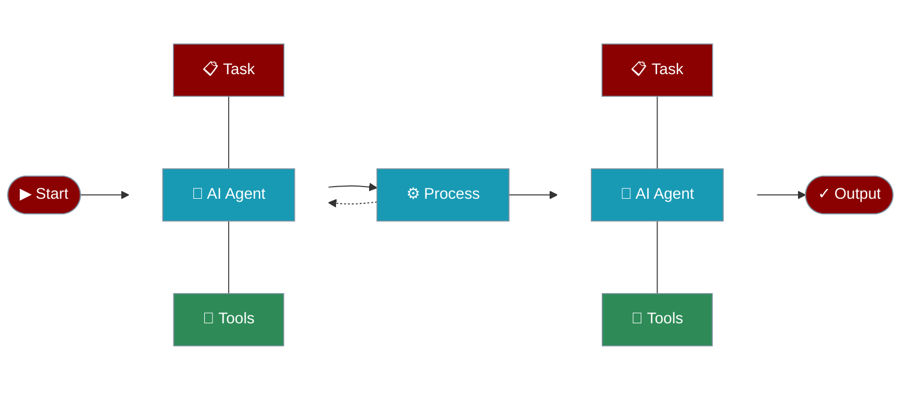

# Introduction

## What is PraisonAI?

PraisonAI is a powerful Multi-Agent Framework for building and deploying AI agents that can understand, reason, and execute complex tasks autonomously.

# Core Components

## Use Cases

## Getting Started is Easy

## Playground

## Key Features

## Chat with One Agent

## Next Steps