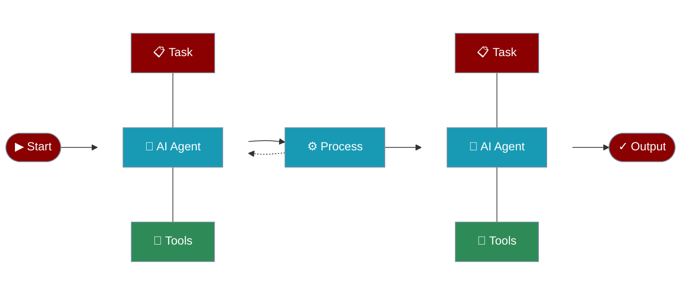

# JavaScript AI Agents Framework

PraisonAI is a production-ready Multi AI Agents framework for JavaScript, designed to create AI Agents to automate and solve problems ranging from simple tasks to complex challenges. It provides a low-code solution to streamline the building and management of multi-agent LLM systems, emphasising simplicity, customisation, and effective human-agent collaboration.

## Usage Examples

## Running the Examples