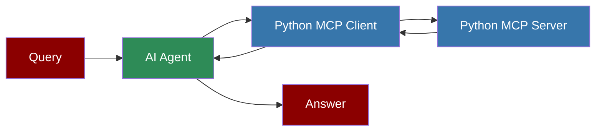

# Custom Python MCP Client

## Custom Python MCP Client



## Overview

The Custom Python MCP Client demonstrates how to integrate a custom Python MCP server with a PraisonAI agent. This client connects to a stock price MCP server to retrieve real-time stock information.

## Quick Start

## Environment Variables

For better security and flexibility, you can modify the client to use environment variables:

```python
import os
from praisonaiagents import Agent, MCP

# Get paths from environment variables or use defaults

python_path = os.getenv("PYTHON_PATH", "/path/to/python")
server_path = os.getenv("SERVER_PATH", "/path/to/server.py")

agent = Agent(
 instructions="""You are a helpful assistant that can check stock prices and perform other tasks.
 Use the available tools when relevant to answer user questions.""",
 llm="gpt-4o-mini",
 tools=MCP(f"{python_path} {server_path}")
)

agent.start("What is the stock price of Tesla?")
```

This approach allows you to set the paths using environment variables:

```bash
export PYTHON_PATH=/Users/praison/miniconda3/envs/mcp/bin/python
export SERVER_PATH=/Users/praison/stockprice/app.py
```