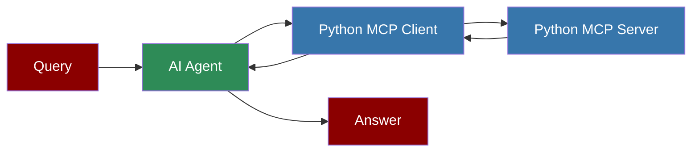

# Custom Python MCP Server

## Custom Python MCP Server

## Overview

The Custom Python MCP Server is a simple implementation of the Model Context Protocol (MCP) that provides stock price information using the yfinance library. This server can be used with PraisonAI agents to retrieve real-time stock prices.

## Server Implementation

Below is the complete implementation of the custom Python MCP server:

## Quick Start