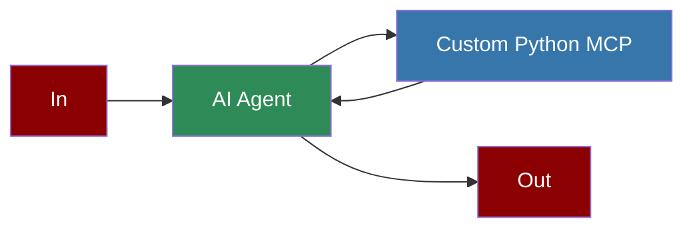

# Custom Python MCP Server



## Quick Start

## Features

## Implementation Details

### FastMCP Class

The `FastMCP` class from the `mcp-python-sdk` package provides a simple way to create MCP servers in Python:

```python
from mcp.server.fastmcp import FastMCP

# Create an MCP server with a name

mcp = FastMCP("my_tools")

# Define a tool using the @mcp.tool decorator

@mcp.tool()
async def my_tool(param1: str, param2: int) -> str:
 """Tool description with clear documentation.

 Args:
 param1: Description of param1
 param2: Description of param2

 Returns:
 Description of the return value
 """
 # Tool implementation

 return f"Processed {param1} with {param2}"

# Run the server with stdio transport

if __name__ == "__main__":
 mcp.run(transport='stdio')
```

### Agent Integration

To use your custom MCP server with PraisonAI agents, use the `MCP` class to specify the command to run your Python script:

```python
from praisonaiagents import Agent, MCP

agent = Agent(
 instructions="Agent instructions",
 llm="gpt-4o-mini",
 tools=MCP(
 command="python", # Or full path to Python

 args=["path/to/your/mcp_server.py"] # Path to your MCP server script

 )
)
```