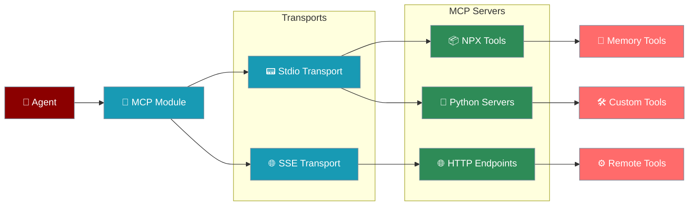

# MCP Tools Integration

The MCP (Model Context Protocol) module enables seamless integration of MCP-compliant tools and servers with PraisonAI agents, supporting both stdio and SSE transport methods.



## Overview

MCP (Model Context Protocol) is a standard for connecting AI assistants to external tools and data sources. The MCP module in PraisonAI provides:
* **Stdio Transport**: Run MCP servers as subprocess commands
* **SSE Transport**: Connect to HTTP/SSE-based MCP servers
* **Automatic Tool Discovery**: Tools are automatically discovered and made available to agents
* **Flexible Integration**: Support for NPX packages, Python scripts, and remote servers

## Quick Start

## Transport Methods

### Stdio Transport

The stdio transport runs MCP servers as subprocesses:

### SSE Transport

The SSE transport connects to HTTP endpoints using Server-Sent Events:

## Available MCP Servers

### Official NPX Servers

### Custom Python Servers

Create your own MCP server in Python:

```python
# mcp_calculator.py

import asyncio
from mcp import Server, Tool

server = Server("calculator")

@server.tool
async def add(a: float, b: float) -> float:
 """Add two numbers"""
 return a + b

@server.tool
async def multiply(a: float, b: float) -> float:
 """Multiply two numbers"""
 return a * b

if __name__ == "__main__":
 asyncio.run(server.run())
```

Use in agent:

```python
agent = Agent(
 tools=MCP("python3 mcp_calculator.py")
)
```

## Tool Discovery

MCP automatically discovers available tools:

```python
# Create MCP instance

mcp = MCP("npx @modelcontextprotocol/server-filesystem")

# Tools are automatically discovered and can be iterated

for tool in mcp:
 print(f"Tool: {tool.name}")
 print(f"Description: {tool.description}")
 print(f"Parameters: {tool.parameters}")

# Assign to agent

agent = Agent(name="File Manager", tools=mcp)
```

## Error Handling

MCP includes built-in error handling and retry logic for robust operation.

```python
try:
 agent = Agent(
 tools=MCP("npx @modelcontextprotocol/server-memory")
 )
 response = agent.start("Store this information")
except Exception as e:
 print(f"MCP Error: {e}")
 # Fallback logic

```

## Advanced Usage

### Multiple MCP Servers

```python
from praisonaiagents import Agent, MCP

# Combine multiple MCP servers

memory_tools = MCP("npx @modelcontextprotocol/server-memory")
file_tools = MCP("npx @modelcontextprotocol/server-filesystem")
custom_tools = MCP("python3 custom_mcp.py")

agent = Agent(
 name="Multi-Tool Assistant",
 instructions="You can manage files and memories.",
 tools=[*memory_tools, *file_tools, *custom_tools]
)
```

### Environment Configuration

```python
import os

# Set environment variables for MCP servers

os.environ["GITHUB_TOKEN"] = "your-github-token"
os.environ["DATABASE_URL"] = "postgresql://..."

# MCP servers can access these variables

github_tools = MCP("npx @modelcontextprotocol/server-github")
db_tools = MCP("python3 database_mcp.py")
```

### Debugging MCP Connections

```python
# Enable debug mode

mcp = MCP(
 "npx @modelcontextprotocol/server-memory",
 debug=True # Prints detailed logs

)

# Check if tools are loaded

if not list(mcp):
 print("No tools discovered from MCP server")
```

## Creating SSE MCP Servers

Example SSE server implementation:

```python
# sse_mcp_server.py

from flask import Flask, Response
import json

app = Flask(__name__)

@app.route('/sse')
def sse():
 def generate():
 # Send tool definitions

 tools = [{
 "name": "get_weather",
 "description": "Get weather information",
 "parameters": {
 "type": "object",
 "properties": {
 "location": {"type": "string"}
 },
 "required": ["location"]
 }
 }]

 yield f"data: {json.dumps({'type': 'tools', 'tools': tools})}\n\n"

 return Response(generate(), mimetype="text/event-stream")

if __name__ == '__main__':
 app.run(port=8080)
```

## Best Practices

## Example: Multi-Tool Agent

## Next Steps