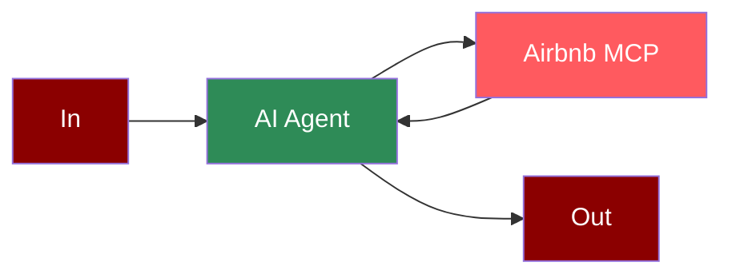

# OpenAI MCP Integration

## Add OpenAI Tool to AI Agent



## Quick Start

## Gradio UI

```python
from praisonaiagents import Agent, MCP
import gradio as gr
import os

# Get API key from environment variable

openai_api_key = os.environ.get("OPENAI_API_KEY")

def search_airbnb(query):
 agent = Agent(
 instructions="You help book apartments on Airbnb.",
 llm="gpt-4o-mini",
 tools=MCP(
 command="npx",
 args=["-y", "@openbnb/mcp-server-airbnb", "--ignore-robots-txt"],

 )
 )
 result = agent.start(query)
 return f"## Airbnb Search Results\n\n{result}"

demo = gr.Interface(
 fn=search_airbnb,
 inputs=gr.Textbox(placeholder="I want to book an apartment in Paris for 2 nights..."),
 outputs=gr.Markdown(),
 title="Airbnb Booking Assistant",
 description="Enter your booking requirements below:"
)

if __name__ == "__main__":
 demo.launch()
```

## Features