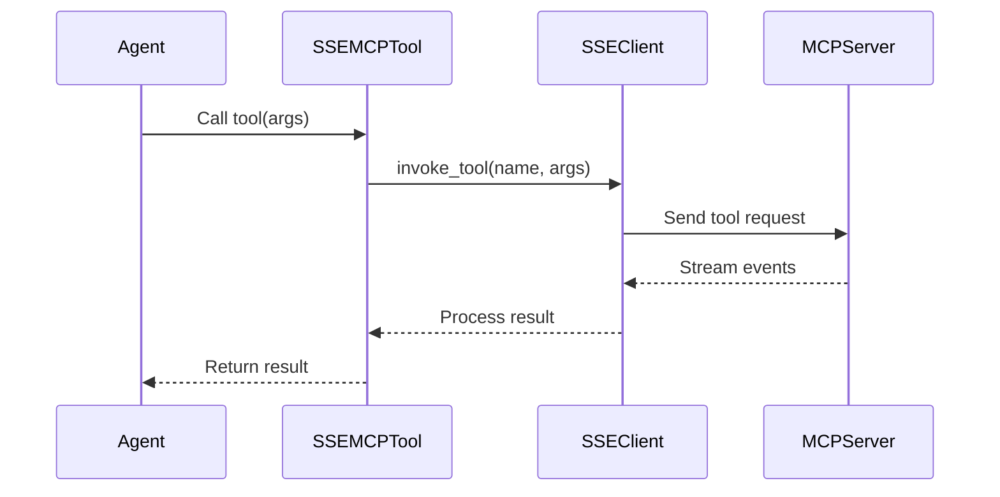

# SSE Transport

## Overview

The MCP SSE (Server-Sent Events) Transport module provides real-time communication between PraisonAI agents and MCP servers using Server-Sent Events. This transport layer enables agents to use tools from MCP servers that communicate via SSE instead of stdio.

```mermaid
flowchart LR
 subgraph "PraisonAI Agent"
 A[Agent] --> T[SSE MCP Tool]
 end

 subgraph "SSE Transport"
 T --> C[SSE Client]
 C --> E[Event Handler]
 E --> AL[Async Loop]
 end

 subgraph "MCP Server"
 AL |HTTP/SSE| S[SSE Server]
 S --> TS[Tool Service]
 end

 style A fill:#189AB4,color:#fff
 style C fill:#2E8B57,color:#fff
 style S fill:#8B0000,color:#fff
```

## Architecture

### Components

## Quick Start

## Core Classes

### SSEMCPClient

The main client class for connecting to SSE-based MCP servers.

```python
class SSEMCPClient:
 def __init__(
 self,
 server_url: str,
 headers: Optional[Dict[str, str]] = None,
 timeout: int = 30
 ):
 """
 Initialize SSE MCP client.

 Args:
 server_url: Base URL of the SSE MCP server
 headers: Optional HTTP headers for authentication
 timeout: Request timeout in seconds
 """
```

#### Key Methods

##### connect()

```python
async def connect(self) -> None:
 """Establish SSE connection and discover server capabilities."""
```

##### discover_tools()

```python
async def discover_tools(self) -> List[Dict[str, Any]]:
 """
 Discover available tools from the MCP server.

 Returns:
 List of tool definitions with schemas
 """
```

##### invoke_tool()

```python
async def invoke_tool(
 self,
 name: str,
 arguments: Dict[str, Any]
) -> Any:
 """
 Invoke a tool on the MCP server.

 Args:
 name: Tool name
 arguments: Tool arguments

 Returns:
 Tool execution result
 """
```

### SSEMCPTool

Wrapper class that makes MCP tools compatible with PraisonAI agents.

```python
class SSEMCPTool:
 def __init__(
 self,
 name: str,
 description: str,
 client: SSEMCPClient,
 input_schema: Dict[str, Any]
 ):
 """
 Create a tool wrapper for an MCP tool.

 Args:
 name: Tool name
 description: Tool description
 client: SSE MCP client instance
 input_schema: JSON schema for tool inputs
 """
```

## Usage Examples

### Basic SSE Connection

```python
from praisonaiagents.mcp import MCP
from praisonaiagents import Agent

# Connect to an SSE MCP server

mcp = MCP(
 server_url="http://localhost:3000/sse",
 transport="sse"
)

# Create agent with MCP tools

agent = Agent(
 name="SearchAgent",
 role="Web Search Specialist",
 tools=mcp.get_tools()
)

# Use the tools

result = agent.chat("Find the latest news about AI")
```

### Authenticated Connection

```python
# Connect with authentication headers

mcp = MCP(
 server_url="https://api.example.com/mcp/sse",
 transport="sse",

)
```

### Custom Event Handling

```python
from praisonaiagents.mcp.mcp_sse import SSEMCPClient

class CustomSSEClient(SSEMCPClient):
 async def _handle_event(self, event: Dict[str, Any]):
 """Custom event handling logic."""
 event_type = event.get("type")

 if event_type == "progress":
 print(f"Progress: {event.get('progress')}%")
 elif event_type == "stream":
 print(f"Stream data: {event.get('data')}")

 # Call parent handler

 await super()._handle_event(event)

# Use custom client

custom_mcp = MCP(
 server_url="http://localhost:8080/sse",
 transport="sse",
 client_class=CustomSSEClient
)
```

### Streaming Responses

```python
# SSE transport automatically handles streaming responses

agent = Agent(
 name="StreamingAgent",
 tools=mcp.get_tools()
)

# Tool responses can include streamed data

response = agent.chat("Generate a long report about climate change")
# The SSE transport will handle incremental updates automatically

```

## Event Flow

### Connection Lifecycle

### Tool Invocation



## Configuration

### MCP Class with SSE

```python
# Full configuration example

mcp = MCP(
 server_url="http://localhost:8080/sse",
 transport="sse",
 ,
 timeout=60, # Longer timeout for streaming

 debug=True # Enable debug logging

)
```

### Environment Variables

```bash
# Optional environment configuration

export MCP_SSE_TIMEOUT=30
export MCP_SSE_MAX_RETRIES=3
export MCP_SSE_DEBUG=true
```

## Error Handling

### Connection Errors

```python
try:
 mcp = MCP(server_url="http://localhost:8080/sse", transport="sse")
 tools = mcp.get_tools()
except ConnectionError as e:
 print(f"Failed to connect to MCP server: {e}")
 # Handle connection failure

except TimeoutError as e:
 print(f"Connection timed out: {e}")
 # Handle timeout

```

### Tool Invocation Errors

```python
from praisonaiagents.mcp.mcp_sse import MCPError

try:
 result = await client.invoke_tool("search", {"query": "test"})
except MCPError as e:
 print(f"MCP error: {e.code} - {e.message}")
 # Handle MCP-specific errors

except Exception as e:
 print(f"Unexpected error: {e}")
 # Handle other errors

```

## Best Practices

## Advanced Topics

### Custom Transport Implementation

```python
from praisonaiagents.mcp.mcp_sse import SSEMCPClient
import aiohttp

class CustomSSETransport(SSEMCPClient):
 async def _create_session(self):
 """Create custom aiohttp session with specific settings."""
 connector = aiohttp.TCPConnector(
 limit=100,
 ttl_dns_cache=300,
 ssl=True
 )

 timeout = aiohttp.ClientTimeout(
 total=300,
 connect=10,
 sock_read=60
 )

 return aiohttp.ClientSession(
 connector=connector,
 timeout=timeout,
 headers=self.headers
 )
```

### Event Stream Processing

```python
class StreamProcessor(SSEMCPClient):
 def __init__(self, *args, **kwargs):
 super().__init__(*args, **kwargs)
 self.stream_buffer = []

 async def _handle_event(self, event: Dict[str, Any]):
 if event.get("type") == "stream":
 # Buffer streaming data

 self.stream_buffer.append(event.get("data"))

 # Process when buffer is full

 if len(self.stream_buffer) >= 10:
 await self._process_buffer()
 else:
 await super()._handle_event(event)

 async def _process_buffer(self):
 # Process buffered stream data

 combined_data = "".join(self.stream_buffer)
 # ... process combined data ...

 self.stream_buffer.clear()
```

### Monitoring and Metrics

```python
import time
from dataclasses import dataclass
from typing import Dict, List

@dataclass
class ConnectionMetrics:
 connected_at: float
 events_received: int
 tools_invoked: int
 errors_count: int
 avg_response_time: float

class MonitoredSSEClient(SSEMCPClient):
 def __init__(self, *args, **kwargs):
 super().__init__(*args, **kwargs)
 self.metrics = ConnectionMetrics(
 connected_at=time.time(),
 events_received=0,
 tools_invoked=0,
 errors_count=0,
 avg_response_time=0.0
 )
 self._response_times: List[float] = []

 async def _handle_event(self, event: Dict[str, Any]):
 self.metrics.events_received += 1
 await super()._handle_event(event)

 async def invoke_tool(self, name: str, arguments: Dict[str, Any]):
 start_time = time.time()
 try:
 result = await super().invoke_tool(name, arguments)
 response_time = time.time() - start_time
 self._response_times.append(response_time)
 self.metrics.tools_invoked += 1
 self.metrics.avg_response_time = sum(self._response_times) / len(self._response_times)
 return result
 except Exception as e:
 self.metrics.errors_count += 1
 raise

 def get_metrics(self) -> Dict[str, Any]:
 return {
 "uptime_seconds": time.time() - self.metrics.connected_at,
 "events_received": self.metrics.events_received,
 "tools_invoked": self.metrics.tools_invoked,
 "errors_count": self.metrics.errors_count,
 "avg_response_time_ms": self.metrics.avg_response_time * 1000
 }
```

## Troubleshooting

**Common Issues:**

### Debug Mode

Enable debug logging to troubleshoot issues:

```python
import logging

# Enable debug logging

logging.basicConfig(level=logging.DEBUG)

# Create MCP with debug mode

mcp = MCP(
 server_url="http://localhost:8080/sse",
 transport="sse",
 debug=True
)

# Check client state

print(f"Connected: {mcp.client.connected}")
print(f"Available tools: {[t.name for t in mcp.get_tools()]}")
```

## Summary

The SSE Transport module enables:

✅ **Real-time Communication** - Stream events and responses via SSE
✅ **Async Operations** - Non-blocking tool invocations
✅ **Automatic Validation** - Pydantic-based input validation
✅ **Event Handling** - Process streaming data and progress updates
✅ **Easy Integration** - Drop-in replacement for stdio transport

Perfect for:
- Real-time streaming applications
- Long-running tool operations
- Progress tracking and updates
- Distributed MCP server deployments