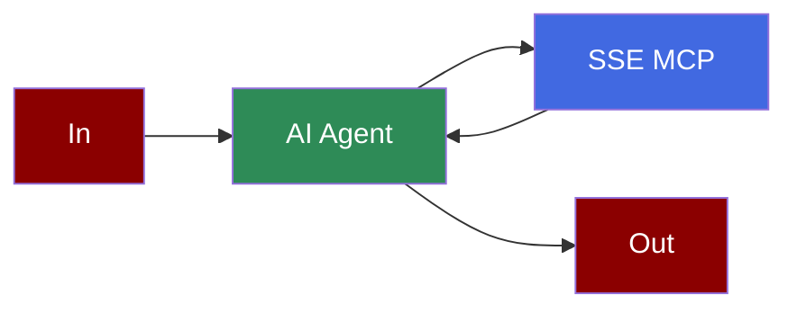

# MCP SSE Integration

## Add SSE Tool to AI Agent



## Quick Start

## Alternative LLM Integrations

### Using Groq with SSE

```python
from praisonaiagents import Agent, MCP

weather_agent = Agent(
 instructions="""You are a weather agent that can provide weather information for a given city.""",
 llm="groq/llama-3.2-90b-vision-preview",
 tools=MCP("http://localhost:8080/sse")
)

weather_agent.start("What is the weather in London?")
```

### Using Ollama with SSE

```python
from praisonaiagents import Agent, MCP

weather_agent = Agent(
 instructions="""You are a weather agent that can provide weather information for a given city.""",
 llm="ollama/llama3.2",
 tools=MCP("http://localhost:8080/sse")
)

weather_agent.start("What is the weather in London? Use get_weather tool, city is the required parameter.")
```

## Gradio UI Integration

Create a Gradio UI for your weather service:

```python
from praisonaiagents import Agent, MCP
import gradio as gr

def get_weather_info(query):
 weather_agent = Agent(
 instructions="""You are a weather agent that can provide weather information for a given city.""",
 llm="gpt-4o-mini",
 tools=MCP("http://localhost:8080/sse")
 )

 result = weather_agent.start(query)
 return f"## Weather Information\n\n{result}"

demo = gr.Interface(
 fn=get_weather_info,
 inputs=gr.Textbox(placeholder="What's the weather in London?"),
 outputs=gr.Markdown(),
 title="Weather MCP Agent",
 description="Ask about the weather in any major city:"
)

if __name__ == "__main__":
 demo.launch()
```

## Features