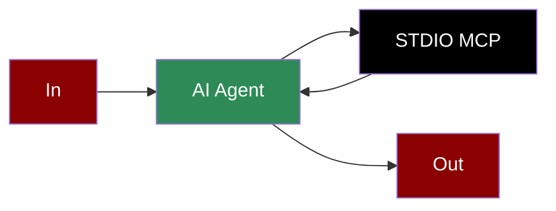

# MCP STDIO Integration

## Add STDIO Tool to AI Agent



## Quick Start

## Alternative LLM Integrations

### Using Groq with STDIO

```python
from praisonaiagents import Agent, MCP

calculator_agent = Agent(
 instructions="""You are a calculator agent that can perform basic arithmetic operations.""",
 llm="groq/llama-3.2-90b-vision-preview",
 tools=MCP("python calculator_server.py")
)

calculator_agent.start("What is 144 divided by 12?")
```

### Using Ollama with STDIO

```python
from praisonaiagents import Agent, MCP

calculator_agent = Agent(
 instructions="""You are a calculator agent that can perform basic arithmetic operations.""",
 llm="ollama/llama3.2",
 tools=MCP("python calculator_server.py")
)

calculator_agent.start("What is 15 + 27? Use the add tool with parameters a and b.")
```

## Gradio UI Integration

Create a Gradio UI for your calculator service:

```python
from praisonaiagents import Agent, MCP
import gradio as gr

def calculate(query):
 calculator_agent = Agent(
 instructions="""You are a calculator agent that can perform basic arithmetic operations.""",
 llm="gpt-4o-mini",
 tools=MCP("python calculator_server.py")
 )

 result = calculator_agent.start(query)
 return f"## Calculation Result\n\n{result}"

demo = gr.Interface(
 fn=calculate,
 inputs=gr.Textbox(placeholder="What is 25 * 16?"),
 outputs=gr.Markdown(),
 title="Calculator MCP Agent",
 description="Ask any arithmetic question:"
)

if __name__ == "__main__":
 demo.launch()
```

## Features