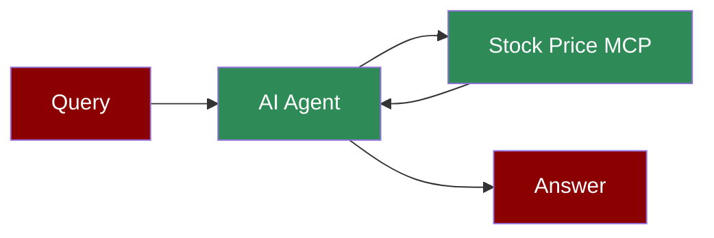

# Stock Price MCP Integration

## Add Stock Price Tool to AI Agent



## Quick Start

## Gradio UI Example

You can also create a simple web UI for your stock price agent using Gradio:

```python
from praisonaiagents import Agent, MCP
import gradio as gr
import os

# Get the path to your Python interpreter and the server file

python_path = os.getenv("PYTHON_PATH", "/path/to/your/python")
server_path = os.getenv("SERVER_PATH", "/path/to/your/stock_price_server.py")

# Create the agent with the stock price MCP tool

agent = Agent(
 instructions="""You are a helpful assistant that can check stock prices.
 Use the available tools when relevant to answer user questions.""",
 llm="gpt-4o-mini",
 tools=MCP(f"{python_path} {server_path}")
)

def chat(message, history):
 return agent.chat(message)

demo = gr.ChatInterface(
 chat,
 title="Stock Price Assistant",
 description="Ask about any stock price and get real-time information",
 theme="soft"
)

if __name__ == "__main__":
 demo.launch()
```

Install Gradio with:
```bash
zsh -c "source $(conda info --base)/etc/profile.d/conda.sh && conda activate windsurf && pip install gradio"
```