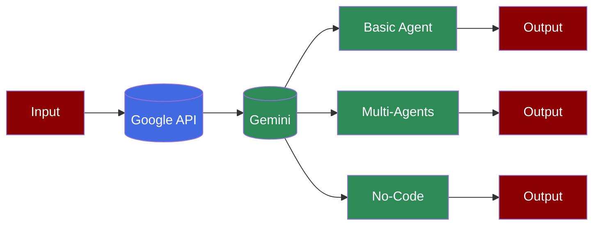

# Google Gemini Agents



## Prerequisites

## Code Implementation

### Basic Usage

The simplest way to use Gemini with PraisonAI Agents:

```python
from praisonaiagents import Agent

agent = Agent(
 instructions="You are a helpful assistant",
 llm="gemini/gemini-1.5-flash-8b",
 self_reflect=True,
 verbose=True
)

agent.start("Why sky is Blue?")
```

### Multi-Agent Setup

Create multiple agents working together:

```python
from praisonaiagents import Agent, Task, PraisonAIAgents

agent = Agent(
 instructions="You are a helpful assistant",
 llm="gemini/gemini-1.5-flash-8b",
 self_reflect=True,
 verbose=True
)

task = Task(
 description="Why sky is Blue?",
 agent=agent,
)

agents = PraisonAIAgents(
 agents=[agent],
 tasks=[task],
)

agents.start()
```

## Gemini 2.0 Flash Thinking

### LLM Configuration

```python
llm_config = {
 "model": "gemini/gemini-2.0-flash-thinking-exp-01-21",
 "response_format": {"type": "text"} # type is text, because json_object is not supported

}
```

## Alternative Setup

### Using Environment Variables

## No-Code Implementation

### Setup

```bash
pip install langchain-google-genai
export GOOGLE_API_KEY=xxxxxxxxxx
```

### YAML Configuration

Create an `agents.yaml` file:

```yaml
framework: crewai
topic: create movie script about cat in mars
roles:
 researcher:
 backstory: Skilled in finding and organizing information, with a focus on research
 efficiency.
 goal: Gather information about Mars and cats
 role: Researcher
 llm:
 model: "google/gemini-1.5-flash-001"
 tasks:
 gather_research:
 description: Research and gather information about Mars, its environment,
 and cats, including their behavior and characteristics.
 expected_output: Document with research findings, including interesting facts
 and information.
 tools:
- ''
```

## Additional Resources

| PraisonAI Chat | PraisonAI Code | PraisonAI (Multi-Agents) |
| --- | --- | --- |
| [Litellm](https://litellm.vercel.app/docs/providers) | [Litellm](https://litellm.vercel.app/docs/providers) | [Models](../models.md) |