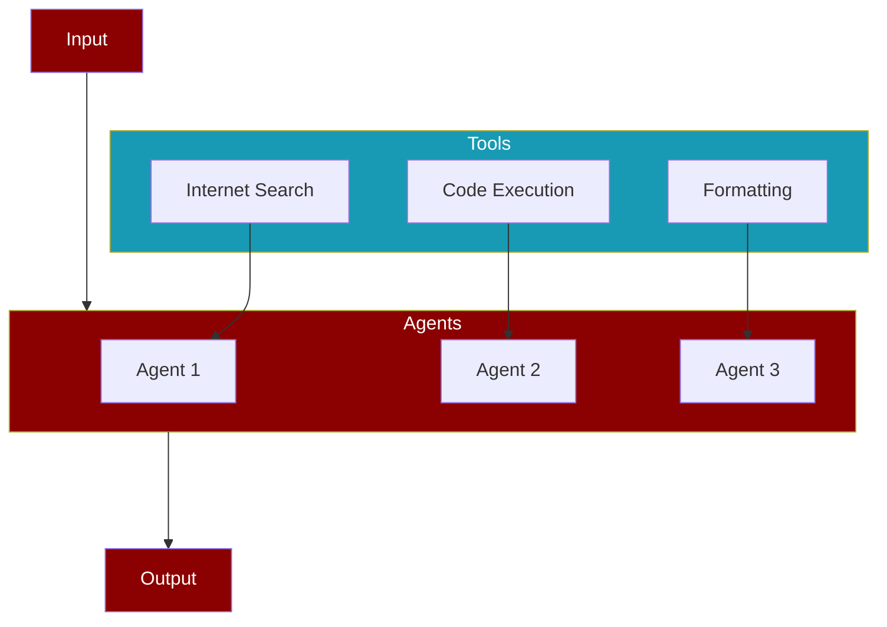

# AI Agents with Tools

| Feature | [Knowledge](/concepts/knowledge) | [Tools](/concepts/tools) |
|---------|--------------------------------|---------------------------|
| Purpose | Static reference information | Dynamic interaction capabilities |
| Access | Read-only reference | Execute actions and commands |
| Updates | Manual through files | Real-time through tool calls |
| Storage | Knowledge base | Assigned to specific agents |
| Persistence | Permanent until changed | Available during agent execution |

## Quick Start

Tools are functions that agents can use to interact with external systems and perform actions. They are essential for creating agents that can do more than just process text.

## Creating Custom Tool

## Creating Custom Tool with Detailed Instructions

## In-build Tools in PraisonAI

## Tools Overview

## Advanced Tool Features

### Tool Configuration

### Tool Chaining

### Tool Categories

## Tool Integration

### Adding Tools to Agents

### Tool Dependencies

## Tool Guidelines

## Best Practices Summary