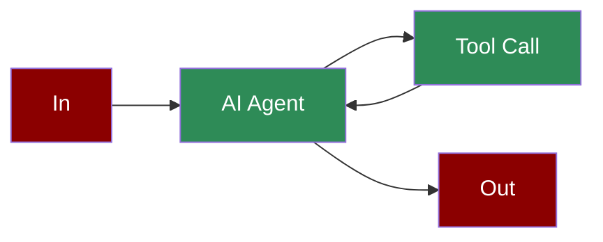

# Tools as Class



A workflow demonstrating how to create and use class-based tools that can be integrated with AI agents to extend their capabilities with custom functionality.

## Quick Start

## Understanding Tools as Class

## Features

## Configuration Options

```python
# Create a custom tool class

class CustomTool(BaseModel):
 """Custom tool with configuration options."""
 api_url: str = Field(default="https://api.example.com")
 headers: Dict[str, str] = Field(default_factory=dict)
 max_retries: int = Field(default=3)

 def run(self, input_data: str) -> str:
 """Main execution method."""
 # Tool implementation

 return "Result"

 def configure(self, **kwargs):
 """Update tool configuration."""
 for key, value in kwargs.items():
 if hasattr(self, key):
 setattr(self, key, value)

# Use the tool with an agent

agent = Agent(
 name="CustomAgent",
 role="Tool User",
 goal="Use custom tool functionality",
 tools=[CustomTool],
 verbose=True
)
```

## Troubleshooting

## Next Steps