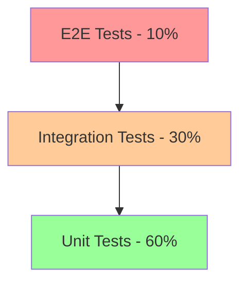

# Testing Agents Guide

Comprehensive testing is crucial for building reliable AI agent systems. This guide covers testing strategies, tools, and best practices for PraisonAI agents.

## Overview

Testing AI agents presents unique challenges:
- Non-deterministic outputs
- External dependencies (LLMs, APIs)
- Complex interaction patterns
- Performance considerations
- Cost implications

## Testing Strategy

### Testing Pyramid



## Setting Up Testing Environment

### 1. Test Configuration

```python
# tests/conftest.py

import pytest
import os
from unittest.mock import Mock, patch
from praisonaiagents import Agent, Task

# Test configuration

@pytest.fixture(scope="session")
def test_config():
 return {
 "use_mock_llm": os.getenv("USE_MOCK_LLM", "true").lower() == "true",
 "test_api_key": "test-key-123",
 "max_test_duration": 30, # seconds

 "mock_response_delay": 0.1 # simulate API delay

 }

# Mock LLM for testing

@pytest.fixture
def mock_llm(test_config):
 if not test_config["use_mock_llm"]:
 return None

 mock = Mock()
 mock.generate.return_value = "Mocked response"
 mock.agenerate.return_value = "Mocked async response"
 return mock

# Test agent fixture

@pytest.fixture
def test_agent(mock_llm):
 agent = Agent(
 name="TestAgent",
 instructions="You are a test agent",
 llm=mock_llm
 )
 return agent
```

### 2. Test Utilities

```python
# tests/utils.py

import asyncio
import time
from typing import Any, Callable, Optional
from contextlib import contextmanager

class TestMetrics:
 def __init__(self):
 self.execution_times = []
 self.token_usage = []
 self.error_count = 0

 def record_execution(self, duration: float, tokens: int = 0):
 self.execution_times.append(duration)
 self.token_usage.append(tokens)

 def record_error(self):
 self.error_count += 1

 def get_stats(self):
 return {
 "avg_execution_time": sum(self.execution_times) / len(self.execution_times) if self.execution_times else 0,
 "total_tokens": sum(self.token_usage),
 "error_rate": self.error_count / (len(self.execution_times) + self.error_count) if self.execution_times else 0
 }

@contextmanager
def measure_performance():
 """Context manager to measure execution time"""
 start = time.time()
 yield
 duration = time.time() - start
 return duration

def async_test(coro):
 """Decorator to run async tests"""
 def wrapper(*args, **kwargs):
 loop = asyncio.get_event_loop()
 return loop.run_until_complete(coro(*args, **kwargs))
 return wrapper
```

## Unit Testing

### 1. Testing Individual Agents

```python
# tests/unit/test_agent.py

import pytest
from unittest.mock import Mock, patch, AsyncMock
from praisonaiagents import Agent

class TestAgent:
 def test_agent_initialization(self):
 """Test agent can be initialized with basic parameters"""
 agent = Agent(
 name="TestAgent",
 instructions="Test instructions",
 llm_model="gpt-4"
 )

 assert agent.name == "TestAgent"
 assert agent.instructions == "Test instructions"
 assert agent.llm_model == "gpt-4"

 def test_agent_with_tools(self):
 """Test agent initialization with tools"""
 mock_tool = Mock()
 mock_tool.name = "test_tool"

 agent = Agent(
 name="ToolAgent",
 instructions="Agent with tools",
 tools=[mock_tool]
 )

 assert len(agent.tools) == 1
 assert agent.tools[0].name == "test_tool"

 @patch('praisonaiagents.agent.agent.litellm.completion')
 def test_agent_run_sync(self, mock_completion):
 """Test synchronous agent execution"""
 # Setup mock response

 mock_completion.return_value = Mock(
 choices=[Mock(message=Mock(content="Test response"))]
 )

 agent = Agent(name="TestAgent", instructions="Test")
 result = agent.run("Test input")

 assert result == "Test response"
 mock_completion.assert_called_once()

 @patch('praisonaiagents.agent.agent.litellm.acompletion')
 async def test_agent_run_async(self, mock_acompletion):
 """Test asynchronous agent execution"""
 # Setup mock response

 mock_acompletion.return_value = Mock(
 choices=[Mock(message=Mock(content="Async test response"))]
 )

 agent = Agent(name="TestAgent", instructions="Test")
 result = await agent.arun("Test input")

 assert result == "Async test response"
 mock_acompletion.assert_called_once()

 def test_agent_validation(self):
 """Test agent input validation"""
 with pytest.raises(ValueError):
 Agent(name="", instructions="Test") # Empty name

 with pytest.raises(ValueError):
 Agent(name="Test", instructions="") # Empty instructions

 with pytest.raises(ValueError):
 Agent(name="Test", instructions="Test", max_tokens=-1) # Invalid max_tokens

```

### 2. Testing Tasks

```python
# tests/unit/test_task.py

import pytest
from unittest.mock import Mock
from praisonaiagents import Task, Agent

class TestTask:
 def test_task_creation(self):
 """Test task initialization"""
 agent = Mock(spec=Agent)
 task = Task(
 description="Test task",
 agent=agent,
 expected_output="Expected result"
 )

 assert task.description == "Test task"
 assert task.agent == agent
 assert task.expected_output == "Expected result"

 def test_task_dependencies(self):
 """Test task with dependencies"""
 agent = Mock(spec=Agent)
 task1 = Task(description="Task 1", agent=agent)
 task2 = Task(description="Task 2", agent=agent, depends_on=[task1])

 assert len(task2.depends_on) == 1
 assert task2.depends_on[0] == task1

 def test_task_context(self):
 """Test task context passing"""
 agent = Mock(spec=Agent)
 context = {"key": "value"}

 task = Task(
 description="Test task",
 agent=agent,
 context=context
 )

 assert task.context == context

 @patch('praisonaiagents.task.task.Task.execute')
 def test_task_execution(self, mock_execute):
 """Test task execution"""
 mock_execute.return_value = "Task completed"

 agent = Mock(spec=Agent)
 task = Task(description="Test", agent=agent)
 result = task.execute()

 assert result == "Task completed"
 mock_execute.assert_called_once()
```

### 3. Testing Tools

```python
# tests/unit/test_tools.py

import pytest
from unittest.mock import Mock, patch
from praisonaiagents import Tool

class TestTools:
 def test_tool_creation(self):
 """Test tool initialization"""
 def sample_function(x: int) -> int:
 return x * 2

 tool = Tool(
 name="multiplier",
 description="Multiplies input by 2",
 function=sample_function
 )

 assert tool.name == "multiplier"
 assert tool.function(5) == 10

 def test_tool_validation(self):
 """Test tool parameter validation"""
 def typed_function(x: int, y: str) -> str:
 return f"{y}: {x}"

 tool = Tool(
 name="typed_tool",
 description="Tool with type hints",
 function=typed_function
 )

 # Should work with correct types

 result = tool.execute(x=5, y="Number")
 assert result == "Number: 5"

 # Should handle type conversion

 result = tool.execute(x="5", y=10)
 assert result == "10: 5"

 def test_async_tool(self):
 """Test asynchronous tool"""
 async def async_function(x: int) -> int:
 return x * 3

 tool = Tool(
 name="async_multiplier",
 description="Async multiplier",
 function=async_function
 )

 assert tool.is_async
 # Test execution would require async context

```

## Integration Testing

### 1. Multi-Agent Integration

```python
# tests/integration/test_multi_agent.py

import pytest
from praisonaiagents import Agent, Task, PraisonAIAgents

class TestMultiAgentIntegration:
 @pytest.mark.integration
 def test_agent_collaboration(self, mock_llm):
 """Test multiple agents working together"""
 researcher = Agent(
 name="Researcher",
 instructions="Research the topic",
 llm=mock_llm
 )

 writer = Agent(
 name="Writer",
 instructions="Write based on research",
 llm=mock_llm
 )

 # Create tasks

 research_task = Task(
 description="Research AI trends",
 agent=researcher,
 expected_output="Research findings"
 )

 writing_task = Task(
 description="Write article on AI trends",
 agent=writer,
 depends_on=[research_task],
 expected_output="Article"
 )

 # Create workflow

 workflow = PraisonAIAgents(
 agents=[researcher, writer],
 tasks=[research_task, writing_task]
 )

 # Execute workflow

 result = workflow.start()

 assert result is not None
 assert len(workflow.results) == 2

 @pytest.mark.integration
 async def test_async_agent_workflow(self, mock_llm):
 """Test asynchronous multi-agent workflow"""
 agents = [
 Agent(name=f"Agent{i}", instructions=f"Process part {i}", llm=mock_llm)
 for i in range(3)
 ]

 tasks = [
 Task(description=f"Task {i}", agent=agents[i])
 for i in range(3)
 ]

 workflow = PraisonAIAgents(agents=agents, tasks=tasks)
 results = await workflow.astart()

 assert len(results) == 3
```

### 2. Tool Integration Testing

```python
# tests/integration/test_tool_integration.py

import pytest
from unittest.mock import Mock, patch
import aiohttp
from praisonaiagents import Agent, Tool

class TestToolIntegration:
 @pytest.mark.integration
 @patch('aiohttp.ClientSession.get')
 async def test_web_search_tool(self, mock_get):
 """Test web search tool integration"""
 # Mock API response

 mock_response = Mock()
 mock_response.json = Mock(]
 })
 mock_get.return_value.__aenter__.return_value = mock_response

 # Create search tool

 async def web_search(query: str) -> str:
 async with aiohttp.ClientSession() as session:
 async with session.get(f"https://api.search.com?") as response:
 data = await response.json()
 return data["results"][0]["snippet"]

 search_tool = Tool(
 name="web_search",
 description="Search the web",
 function=web_search
 )

 # Test with agent

 agent = Agent(
 name="SearchAgent",
 instructions="Search for information",
 tools=[search_tool]
 )

 result = await agent.arun("Search for test")
 assert "Test result" in str(result)

 @pytest.mark.integration
 def test_tool_error_handling(self):
 """Test tool error handling"""
 def failing_tool(x: int) -> int:
 raise ValueError("Tool failed")

 tool = Tool(
 name="failing_tool",
 description="Tool that fails",
 function=failing_tool
 )

 agent = Agent(
 name="TestAgent",
 instructions="Use the tool",
 tools=[tool]
 )

 # Agent should handle tool failure gracefully

 with pytest.raises(Exception):
 agent.run("Use failing_tool with x=5")
```

## Performance Testing

### 1. Load Testing

```python
# tests/performance/test_load.py

import pytest
import asyncio
import time
from concurrent.futures import ThreadPoolExecutor, as_completed
from praisonaiagents import Agent

class TestPerformance:
 @pytest.mark.performance
 def test_concurrent_agents(self, test_agent):
 """Test multiple agents running concurrently"""
 num_agents = 10
 num_requests = 5

 def run_agent(agent_id):
 agent = Agent(
 name=f"Agent{agent_id}",
 instructions="Process request"
 )
 results = []
 for i in range(num_requests):
 start = time.time()
 result = agent.run(f"Request {i}")
 duration = time.time() - start
 results.append(duration)
 return results

 with ThreadPoolExecutor(max_workers=num_agents) as executor:
 futures = [executor.submit(run_agent, i) for i in range(num_agents)]
 all_results = []

 for future in as_completed(futures):
 all_results.extend(future.result())

 avg_time = sum(all_results) / len(all_results)
 assert avg_time str:
 self.call_count += 1
 self.last_prompt = prompt

 # Simulate processing time

 time.sleep(0.1)

 # Check for specific responses

 for key, response in self.responses.items():
 if key in prompt.lower():
 return response

 # Return random default response

 return random.choice(self.default_responses)

 async def agenerate(self, prompt: str, **kwargs) -> str:
 await asyncio.sleep(0.1)
 return self.generate(prompt, **kwargs)

# Usage in tests

@pytest.fixture
def smart_mock_llm():
 return MockLLM()
```

### 2. Tool Mocking

```python
# tests/mocks/tool_mock.py

class MockTool:
 def __init__(self, name: str, return_value: Any = None, side_effect: Any = None):
 self.name = name
 self.return_value = return_value
 self.side_effect = side_effect
 self.call_count = 0
 self.call_args_list = []

 def execute(self, **kwargs):
 self.call_count += 1
 self.call_args_list.append(kwargs)

 if self.side_effect:
 if isinstance(self.side_effect, Exception):
 raise self.side_effect
 return self.side_effect(**kwargs)

 return self.return_value or f"Mock result from {self.name}"

# Usage

mock_search = MockTool(
 name="search",
 return_value="Search results for your query"
)

mock_calculator = MockTool(
 name="calculator",
 side_effect=lambda expression: eval(expression)
)
```

## Test Data Management

### 1. Fixtures and Factories

```python
# tests/factories.py

from dataclasses import dataclass
from typing import List, Optional
import factory
from faker import Faker

fake = Faker()

@dataclass
class TestScenario:
 name: str
 input: str
 expected_output: str
 agent_instructions: str
 tools: List[str] = None

class ScenarioFactory(factory.Factory):
 class Meta:
 model = TestScenario

 name = factory.LazyFunction(lambda: f"Scenario_{fake.word()}")
 input = factory.LazyFunction(fake.sentence)
 expected_output = factory.LazyFunction(fake.paragraph)
 agent_instructions = factory.LazyFunction(
 lambda: f"You are a {fake.job()} assistant"
 )
 tools = factory.LazyFunction(
 lambda: [fake.word() for _ in range(random.randint(0, 3))]
 )

# Usage

test_scenarios = [ScenarioFactory() for _ in range(10)]
```

### 2. Test Data Sets

```python
# tests/data/test_cases.py

TEST_CASES = {
 "simple_queries": [
 ("What is 2+2?", "4"),
 ("Hello", "Hello! How can I help you?"),
 ("Goodbye", "Goodbye! Have a great day!")
 ],
 "complex_queries": [
 (
 "Analyze the sentiment of: This product is amazing!",
 "positive"
 ),
 (
 "Summarize: Long text here...",
 "Summary of the text"
 )
 ],
 "edge_cases": [
 ("", "I didn't receive any input."),
 ("🤖" * 100, "I see you've sent many robot emojis."),
 (None, "Invalid input received.")
 ]
}
```

## Continuous Integration

### 1. GitHub Actions Configuration

```yaml
# .github/workflows/test.yml

name: Test Suite

on:
 push:
 branches: [ main, develop ]
 pull_request:
 branches: [ main ]

jobs:
 test:
 runs-on: ubuntu-latest
 strategy:
 matrix:
 python-version: [3.8, 3.9, 3.10, 3.11]

 steps:
- uses: actions/checkout@v3
- name: Set up Python
 uses: actions/setup-python@v4
 with:
 python-version: ${{ matrix.python-version }}
- name: Cache dependencies
 uses: actions/cache@v3
 with:
 path: ~/.cache/pip
 key: ${{ runner.os }}-pip-${{ hashFiles('**/requirements.txt') }}
- name: Install dependencies
 run: |
 python -m pip install --upgrade pip
 pip install -r requirements.txt
 pip install -r requirements-test.txt
- name: Run unit tests
 run: |
 pytest tests/unit -v --cov=praisonaiagents --cov-report=xml
 env:
 USE_MOCK_LLM: true
- name: Run integration tests
 run: |
 pytest tests/integration -v -m integration
 env:
 USE_MOCK_LLM: true
- name: Run performance tests
 run: |
 pytest tests/performance -v -m performance
 if: github.event_name == 'push'
- name: Upload coverage
 uses: codecov/codecov-action@v3
 with:
 file: ./coverage.xml
```

### 2. Test Reporting

```python
# tests/pytest.ini

[pytest]
minversion = 6.0
addopts =
 -ra
 -q
 --strict-markers
 --cov=praisonaiagents
 --cov-report=html
 --cov-report=term-missing
 --maxfail=1
 --tb=short
 --benchmark-disable

markers =
 unit: Unit tests
 integration: Integration tests
 performance: Performance tests
 slow: Slow tests
 flaky: Flaky tests that may fail occasionally

testpaths = tests

# Coverage settings

[coverage:run]
source = praisonaiagents
omit =
 */tests/*
 */migrations/*
 */__pycache__/*

[coverage:report]
precision = 2
show_missing = True
skip_covered = False
```

## Best Practices

### 1. Test Naming Conventions

```python
# Good test names

def test_agent_should_return_error_when_invalid_input():
 pass

def test_task_execution_with_dependencies_completes_in_order():
 pass

def test_memory_clears_old_messages_when_limit_exceeded():
 pass

# Bad test names

def test_agent(): # Too vague

 pass

def test_1(): # Not descriptive

 pass
```

### 2. Test Organization

```
tests/
├── conftest.py # Shared fixtures

├── unit/ # Unit tests

│ ├── test_agent.py
│ ├── test_task.py
│ └── test_tools.py
├── integration/ # Integration tests

│ ├── test_workflows.py
│ └── test_multi_agent.py
├── performance/ # Performance tests

│ └── test_load.py
├── e2e/ # End-to-end tests

│ └── test_scenarios.py
├── mocks/ # Mock implementations

│ └── llm_mock.py
└── data/ # Test data

 └── test_cases.py
```

### 3. Testing Checklist

## Common Testing Patterns

### 1. Parameterized Testing

```python
@pytest.mark.parametrize("input,expected", [
 ("Hello", "Hi there!"),
 ("How are you?", "I'm doing well!"),
 ("Goodbye", "See you later!"),
])
def test_agent_responses(test_agent, input, expected):
 result = test_agent.run(input)
 assert expected in result
```

### 2. Snapshot Testing

```python
# tests/test_snapshots.py

import pytest
from syrupy import snapshot

def test_agent_output_snapshot(test_agent, snapshot):
 result = test_agent.run("Generate a report")
 assert result == snapshot
```

### 3. Property-Based Testing

```python
# tests/test_properties.py

from hypothesis import given, strategies as st

@given(st.text(min_size=1, max_size=1000))
def test_agent_handles_any_text_input(test_agent, text):
 result = test_agent.run(text)
 assert result is not None
 assert isinstance(result, str)
 assert len(result) > 0
```

## Debugging Failed Tests

### 1. Debug Utilities

```python
# tests/debug_utils.py

import json
import pdb
from rich import print as rprint
from rich.table import Table

def debug_agent_state(agent):
 """Print agent state for debugging"""
 table = Table(title=f"Agent: {agent.name}")
 table.add_column("Property", style="cyan")
 table.add_column("Value", style="green")

 table.add_row("Instructions", agent.instructions[:50] + "...")
 table.add_row("Tools", str(len(agent.tools)))
 table.add_row("Memory Size", str(len(agent.memory.messages)))
 table.add_row("Model", agent.llm_model)

 rprint(table)

def trace_execution(func):
 """Decorator to trace function execution"""
 def wrapper(*args, **kwargs):
 print(f"Entering {func.__name__}")
 pdb.set_trace()
 result = func(*args, **kwargs)
 print(f"Exiting {func.__name__} with result: {result}")
 return result
 return wrapper
```

### 2. Test Debugging Tips

```python
# Enable detailed logging for failed tests

def test_complex_workflow():
 import logging
 logging.basicConfig(level=logging.DEBUG)

 # Your test code here

# Use pytest debugging

# Run with: pytest -vv --pdb --pdbcls=IPython.terminal.debugger:Pdb

# Capture stdout/stderr

def test_with_output(capsys):
 agent.run("test")
 captured = capsys.readouterr()
 print(f"Stdout: {captured.out}")
 print(f"Stderr: {captured.err}")
```

## Next Steps

1. Set up [CI/CD Pipeline](/docs/deploy/deploy)
2. Implement [Monitoring](/docs/monitoring/agentops)
3. Review [Best Practices](/docs/concepts/agents)
4. Explore [Advanced Testing Patterns](https://docs.pytest.org/en/latest/contents.html)

## Additional Resources

- [Pytest Documentation](https://docs.pytest.org/)
- [Testing Best Practices](https://testdriven.io/blog/testing-best-practices/)
- [Mock Documentation](https://docs.python.org/3/library/unittest.mock.html)
- [Hypothesis for Property Testing](https://hypothesis.readthedocs.io/)