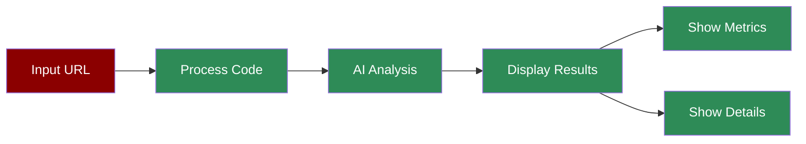

# Code Analysis Agent UI

## What is the Code Analysis Streamlit App?

The Code Analysis Streamlit App provides a user-friendly web interface for analyzing code repositories and generating comprehensive quality assessments. It combines AI-powered code analysis with an interactive dashboard to display detailed metrics, recommendations, and insights.

## Features

## Quick Start

## Understanding the Interface

The Streamlit app provides an intuitive interface with the following sections:
- **Input**: GitHub URL or local path input in the sidebar
- **Overall Metrics**: Visual display of key quality scores
- Overall Quality
- Architecture Score
- Maintainability Score
- Performance Score
- Security Score
- Test Coverage
- **Detailed Analysis**:
- Code Metrics with Findings
- Technology Stack Overview
- Complexity Metrics
- **Key Findings**:
- Strengths
- Best Practices
- Areas for Improvement
- Potential Risks
- **Additional Information**:
- Recommendations
- Documentation Quality Assessment

## Next Steps