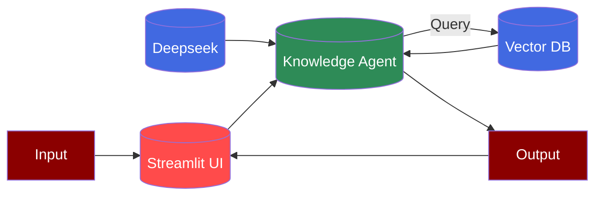

# Deepseek Streamlit UI



## Prerequisites

## Code

```python
import streamlit as st
from praisonaiagents import Agent

def init_agent():
 config = {
 "vector_store": {
 "provider": "chroma",
 "config": {
 "collection_name": "praison",
 "path": ".praison"
 }
 },
 "llm": {
 "provider": "ollama",
 "config": {
 "model": "deepseek-r1:latest",
 "temperature": 0,
 "max_tokens": 8000,
 "ollama_base_url": "http://localhost:11434",
 },
 },
 "embedder": {
 "provider": "ollama",
 "config": {
 "model": "nomic-embed-text:latest",
 "ollama_base_url": "http://localhost:11434",
 "embedding_dims": 1536
 },
 },
 }

 return Agent(
 name="Knowledge Agent",
 instructions="You answer questions based on the provided knowledge.",
 knowledge=["kag-research-paper.pdf"],
 knowledge_config=config,
 user_id="user1",
 llm="deepseek-r1"
 )

st.title("Knowledge Agent Chat")

if "agent" not in st.session_state:
 st.session_state.agent = init_agent()
 st.session_state.messages = []

if "messages" in st.session_state:
 for message in st.session_state.messages:
 with st.chat_message(message["role"]):
 st.markdown(message["content"])

prompt = st.chat_input("Ask a question...")

if prompt:
 st.session_state.messages.append({"role": "user", "content": prompt})
 with st.chat_message("user"):
 st.markdown(prompt)

 with st.chat_message("assistant"):
 response = st.session_state.agent.start(prompt)
 st.markdown(response)
 st.session_state.messages.append({"role": "assistant", "content": response})
```

## Features