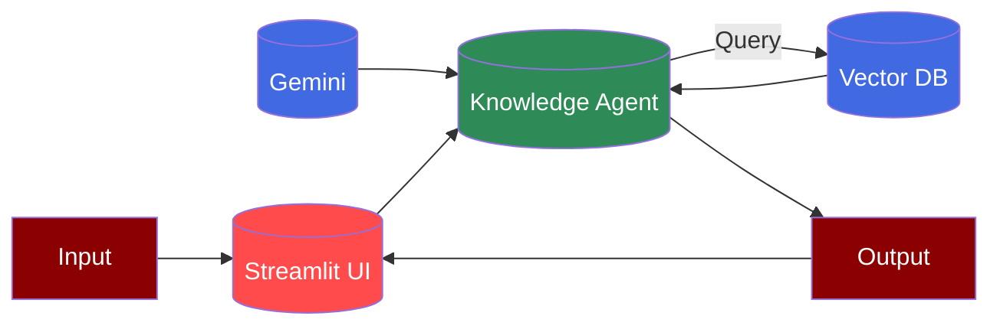

# Gemini Streamlit UI



## Prerequisites

## Code

```python
import streamlit as st
from praisonaiagents import Agent

st.title("Gemini 2.0 Thinking AI Agent")

# Initialize the agent

@st.cache_resource
def get_agent():
 llm_config = {
 "model": "gemini/gemini-2.0-flash-thinking-exp-01-21",
 "response_format": {"type": "text"}
 }

 return Agent(
 instructions="You are a helpful assistant",
 llm=llm_config
 )

agent = get_agent()

# Create text area input field

user_question = st.text_area("Ask your question:", height=150)

# Add ask button

if st.button("Ask"):
 if user_question:
 with st.spinner('Thinking...'):
 result = agent.start(user_question)
 st.write("### Answer")

 st.write(result)
 else:
 st.warning("Please enter a question")
```

## Features