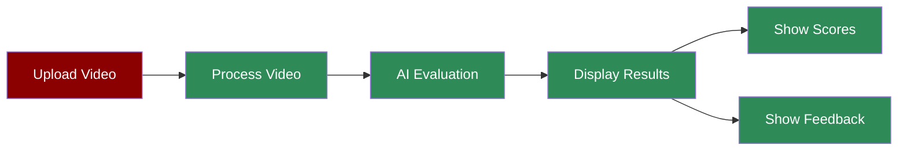

# Hackathon Judge Agent UI

## What is the Hackathon Judge Streamlit App?

The Hackathon Judge Streamlit App provides a user-friendly web interface for evaluating hackathon projects through video demonstrations. It combines the power of AI evaluation with an interactive dashboard to display comprehensive project assessments, scores, and feedback.

## Features

## Quick Start

## Understanding the Interface

The Streamlit app provides an intuitive interface with the following sections:
- **Video Upload**: Drag and drop or browse to upload your project demo video
- **Overall Score**: A prominent display of the project's overall rating
- **Detailed Scores**:
- Innovation Score
- Technical Complexity
- Presentation Quality
- User Experience
- Project Completeness
- **Qualitative Feedback**:
- Key Strengths
- Areas for Improvement
- Technical Highlights
- Notable Features
- Recommendations
- **Market Analysis**:
- Market Potential
- Scalability Assessment

## Next Steps